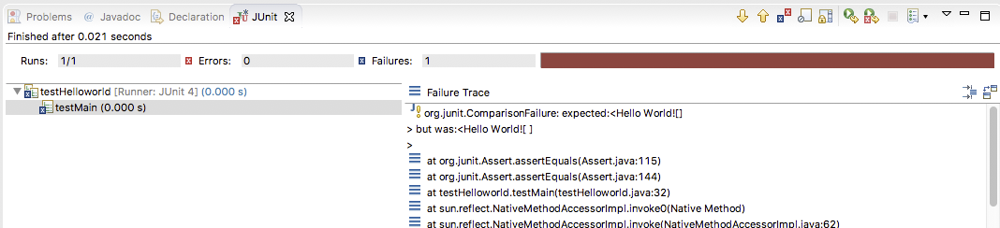

# ex001 
## 练习要求
编写程序，输出 "Hello World!" 。不包括引号。

## 操作步骤
helloworld 目录下为 eclipse 工程。
其中的 Helloworld.java 程序不完全，请补充代码，实现要求的功能。
并能够通过 testHelloworld.java 中的单元测试。

## 评判方法
通过 testHelloworld.java 中的单元测试。

## 单元测试执行方法
在 eclipse 中，打开 testHelloworld.java 文件，  
按快捷键 Ctrl-Alt-x t 执行单元测试。  
如果测试结果呈现绿色状态条，即为验证通过。如下图：  
  

为红色，说明验证不通过，需要修改程序。如下图：  
  

